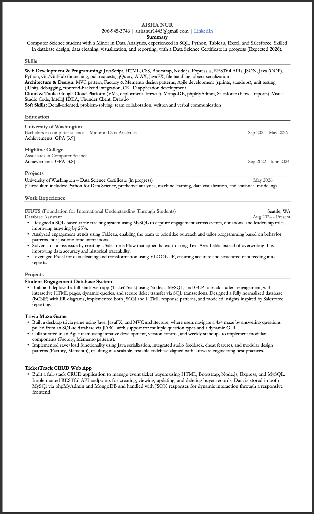

# Welcome to My Portfolio

**Computer Science + Data Analytics Student**  
Building data-driven applications and tools that turn messy data into clear, actionable insights.

---

## Home / Introduction

Hi, I'm **Aisha Nur**, a Computer Science student at the University of Washington with a **Minor in Data Analytics** and a **Data Science Certificate in progress (expected 2026)**.  

I enjoy building full-stack applications, designing databases, and using data to answer real-world questions. Recently, I’ve been working with **SQL, Python, Node.js, Tableau, and Salesforce** to support student engagement and program decisions.

---

## About Me

I started my journey in computer science at **Highline College**, where I earned my **Associate in Computer Science (GPA 3.8)**. I then transferred to the **University of Washington** to pursue my **Bachelor’s in Computer Science** with a **Minor in Data Analytics (current GPA 3.9)**.

My interests sit at the intersection of **software development** and **data analytics**. I love:

- Designing **databases** that actually match real use cases  
- Building **web applications** that connect frontends to real data  
- Using **analytics and visualization** to tell clear stories from data  

I’m also involved outside the classroom. I serve as **Treasurer for the Women in Cybersecurity (WiCyS) Club**, where I help organize events, manage budgets, and create a welcoming space for students exploring security and tech.

In the long term, I’m aiming for roles in **data analytics, data science, or data-focused software engineering**, where I can combine my coding skills with my love for working with real-world datasets.

---

## Projects (In Progress)

### 1. Student Engagement Database System (TicketTrack)

A full-stack **student engagement tracking system** inspired by real needs at FIUTS, designed to track event attendance, leadership roles, and engagement across multiple programs.

- **Technologies:** Node.js, Express.js, MySQL, Google Cloud Platform (VM), HTML, CSS, JavaScript, Bootstrap, SQL, JSON
- **Key Features:**
  - Fully normalized database (BCNF) with ER diagrams and clear relationships
  - Interactive HTML pages with dynamic queries and filters
  - Support for secure ticket transfer between students using SQL transactions
  - Both **JSON APIs** and **HTML-based responses** for flexibility
- **Challenges & Key Learnings:**
  - Learned how to design a database from scratch and normalize it to BCNF
  - Deployed a real web app using a GCP VM, managing firewall rules and environment setup
  - Practiced connecting frontend forms to backend routes and SQL queries in a clean, testable way

 GitHub link : [GitHub Repository](https://github.com/aishanur11/tickettrack_database)

---

### 2. TicketTrack CRUD Web App

A CRUD-focused web app that manages **event ticket buyers**, built as a foundation for the larger engagement system.

- **Technologies:** HTML, CSS, Bootstrap, Node.js, Express.js, MySQL, MongoDB, RESTful APIs, JSON
- **What It Does:**
  - Allows users to **create, read, update, and delete** buyer records
  - Stores data in both MySQL (via phpMyAdmin) and MongoDB
  - Uses JSON responses to power dynamic interactions on the frontend
- **Challenges & Key Learnings:**
  - Gained experience designing RESTful routes and structuring Express controllers
  - Learned how to keep frontend and backend in sync through clean API design
  - Practiced handling data in multiple storage systems (SQL and NoSQL)

 _GitHub link : [Github Repository](https://github.com/aishanur11/assign3-client-server-crud)

---

### 3. Trivia Maze Game

A desktop game that combines **Java, databases, and design patterns**. Players navigate a 4x4 maze by answering questions stored in a database.

- **Technologies:** Java, JavaFX, SQLite, JDBC, MVC, Factory + Memento patterns, Object Serialization
- **Key Features:**
  - GUI built in JavaFX with dynamic question screens
  - Questions loaded from SQLite via JDBC, with support for multiple question types
  - Save/load game state using Java object serialization
  - Audio feedback and “cheat” features for an engaging user experience
- **Challenges & Key Learnings:**
  - Applied **MVC architecture** to separate logic, UI, and data
  - Used **design patterns** (Factory, Memento) to keep the code modular and maintainable
  - Worked in an Agile-style team with iterative sprints and version control

 _GitHub link coming soon_

---

##  Skills

### Programming & Web Development
- **Languages:** Java, Python, JavaScript, HTML, CSS
- **Web & Backend:** Node.js, Express.js, RESTful APIs, JSON, jQuery, AJAX, JavaFX
- **Concepts:** Object-Oriented Programming (OOP), file handling, object serialization

### Architecture & Design
- **Patterns & Practices:** MVC, Factory, Memento, unit testing (JUnit), debugging  
- **Development:** Agile methods (sprints, standups), frontend–backend integration, CRUD app development

### Data, Databases & Tools
- **Databases:** MySQL, MongoDB, SQLite, phpMyAdmin  
- **Data & Analytics Tools:** SQL, Tableau, Excel (including VLOOKUP), basic data cleaning & transformation  
- **Cloud & Platforms:** Google Cloud Platform (VMs, deployment, firewall config)
- **Other Tools:** Salesforce (Flows, reports), Visual Studio Code, IntelliJ IDEA, Thunder Client, Draw.io

### In Progress
- **Data Science Certificate (Expected 2026):**  
  - Coursework in Python for Data Science, predictive analytics, machine learning, data visualization, and statistical modeling

---

##  Experience

### Database Assistant – FIUTS (Foundation for International Understanding Through Students)  
_Seattle, WA • Aug 2024 – Present_

- Designed a **SQL-based raffle tracking system** using MySQL to capture engagement across events, donations, and leadership roles, improving targeting by **25%**.
- Built Tableau dashboards to analyze engagement trends and support data-driven programming decisions.
- Solved a **data loss issue** by creating a Salesforce Flow that appends text to Long Text Area fields instead of overwriting, improving historical data accuracy.
- Used Excel (including VLOOKUP and cleaning functions) to prepare clean, structured data for reporting.

---

### Treasurer – Women in Cybersecurity (WiCyS) Club  
_University of Washington_

- Manage the club budget and funding requests for events and workshops.
- Coordinate with officers to plan meetings, awareness events, and student activities.
- Help create an inclusive and supportive environment for students interested in cybersecurity and technology.

---

### Additional Academic Experience

- Built multiple course-based projects including:
  - Full-stack database-backed applications
  - Desktop applications using Java and JavaFX
  - Data-driven assignments using Python, SQL, and visualization tools

---

## Education

**University of Washington**  
_Bachelor’s in Computer Science – Minor in Data Analytics_  
**GPA:** 3.9 • _Sep 2024 – May 2026_

**Highline College**  
_Associate in Computer Science_  
**GPA:** 3.8 • _Sep 2022 – June 2024_

---

##  Resume

You can view or download my resume here:

- **[Download my resume](./resume.pdf)**

---

##  Contact

- **Email:** [aishanur1445@gmail.com](mailto:aishanur1445@gmail.com)  
- **LinkedIn:** [My linkedin](https://www.linkedin.com/in/aisha-nur)  
- **GitHub:** [My github](https://github.com/aishanur11)

Feel free to reach out about internships, collaborations, or projects!
